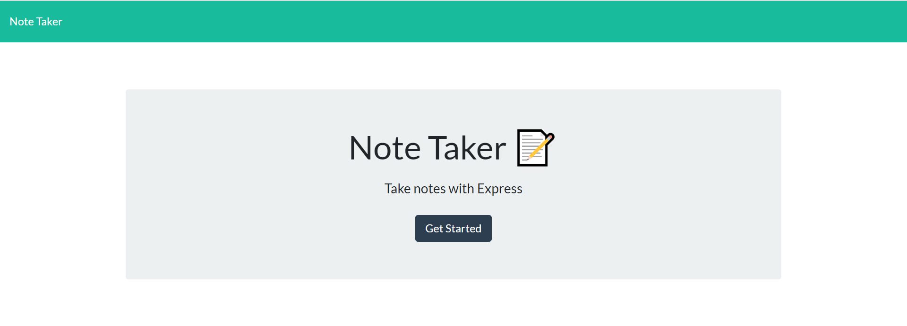
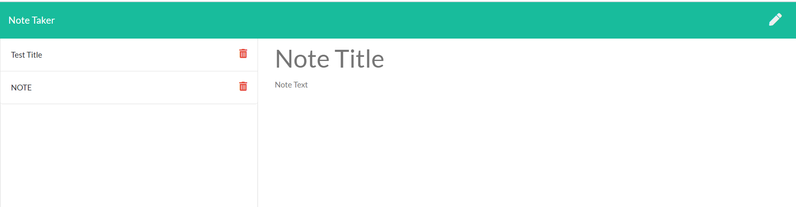

# Note Taker Starter Code

## Task

Create an application that can be used to write and save notes. This application will use an Express.js back end and will save and retrieve note data from a JSON file.

 

## User Story

AS A small business owner  
I WANT to be able to write and save notes  
SO THAT I can organize my thoughts and keep track of tasks I need to complete  

## Installation

If you would like this on your local environment, clone the repository.

`
git clone https://github.com/maiyiax/note-taker.git
`

Then run `npm install`. Once all the necessary modules have been installed, you can start the app by running `node server.js` and opening up http://localhost:3001/ in your browser.

The app can also be used at it's deployed site on [Heroku](https://morning-springs-52870.herokuapp.com/).

## Contributors

Starter code was provided by [UW-Bootcamp](https://github.com/coding-boot-camp/miniature-eureka).
